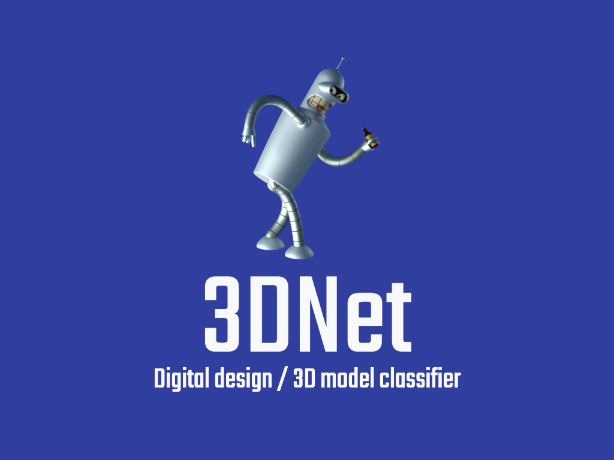
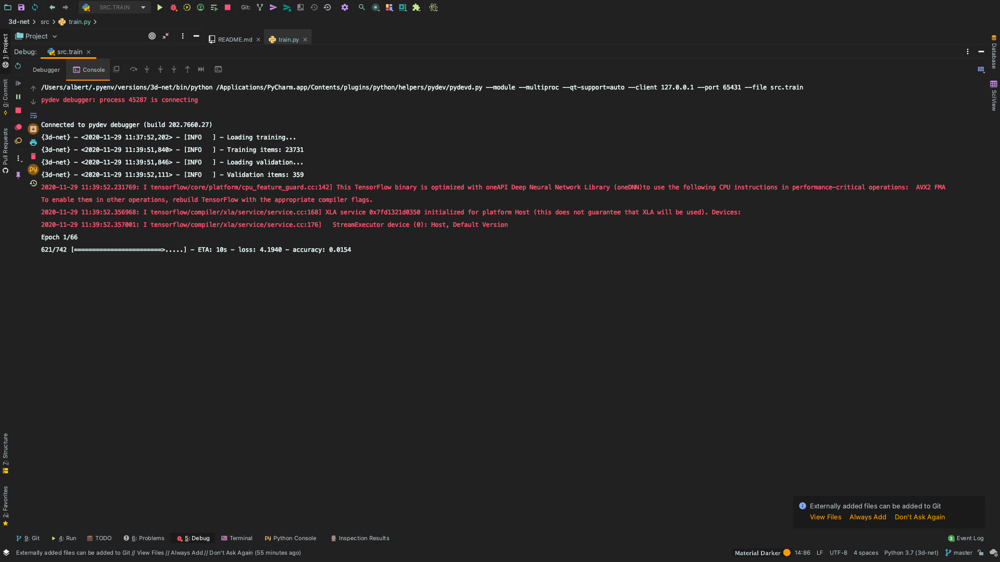
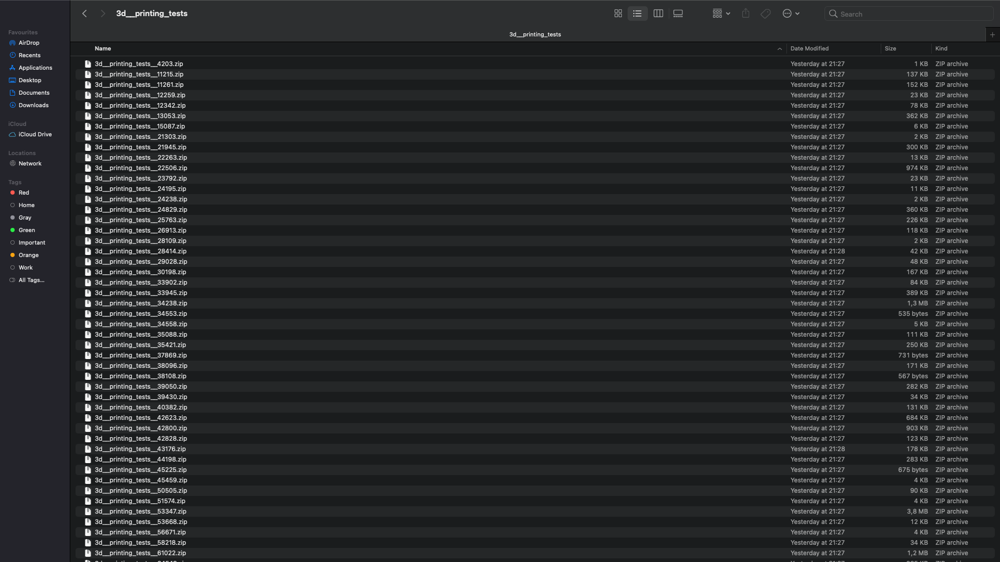
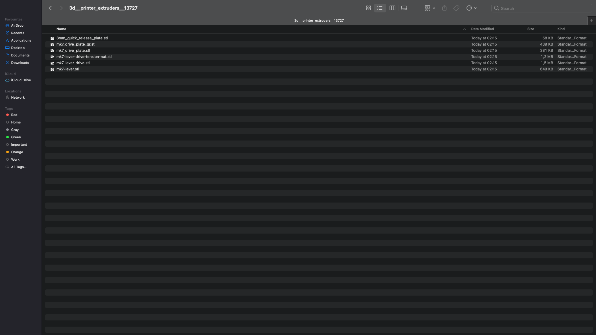

<br>
<p align="center">
  
</p>
<br>

[](http://hits.dwyl.io/AlbertSuarez/3d-net)

[](https://gitHub.com/AlbertSuarez/3d-net/stargazers/)
[](https://gitHub.com/AlbertSuarez/3d-net/network/)
[](https://gitHub.com/AlbertSuarez/3d-net/graphs/contributors/)
[](https://github.com/AlbertSuarez/3d-net/blob/master/LICENSE)

[Website](http://asuarez.dev/3d-net) | [Devpost](https://devpost.com/software/3d-net) | [Model weights](https://asuarez.dev/3d-net/weights/sigmoid/model.h5)

🗃 Digital design / 3D model classifier developed at [HackEPS 2020](https://lleidahack.github.io/hackeps-2020).

## Summary

### Inspiration

I always had an interest in the Machine Learning world, and given the fact that I'm currently working an AI start-up ([restb.ai](https://restb.ai)) based on Image processing as a Software Engineer, I always hear those typical works like _accuracy_, _layer_, _neurons_, _convolutions_, etc, but I've never had the opportunity to jump into the code by myself.

Seeing the challenge proposed by [Invelon](https://www.invelon.com/) at this year's HackEPS, about to create a classifier for 3D models or Digital designs based on their category, I didn't want to lose the opportunity to discover this world, even playing with a non-common data type like STLs.

### What it does

**3D Net** is a classification neural network which is able to classify a group of STL files, representing a 3D model, in one of the 66 category that the model has.

```
3d__printer_accessories, 3d__printer_extruders, 3d__printer_parts, 3d__printers, 3d__printing_tests, art__2d, art__tools, art__coins_badges, art__interactive, art__math, art__scans_replicas, art__sculptures, art__signs_logos, fashion__accessories, fashion__bracelets, fashion__costume, fashion__earrings, fashion__glasses, fashion__jewelry, fashion__keychains, fashion__rings, gadgets__audio, gadgets__camera, gadgets__computer, gadgets__mobile_phone, gadgets__tablet, gadgets__video_games, hobby__automotive, hobby__diy, hobby__electronics, hobby__music, hobby__rc_vehicles, hobby__robotics, hobby__sport_outdoors, household__bathroom, household__containers, household__decor, household__supplies, household__kitchen_dining, household__office_organization, household__outdoor_garden, household__pets, learning__biology, learning__engineering, learning__math, learning__physics_astronomy, models__animals, models__buildings_structures, models__creatures, models__food_drink, models__furniture, models__robots, models__people, models__props, models__vehicles, tools__hand, tools__machine, tools__holders_boxes, toys__chess, toys__construction, toys__dice, toys__games, toys__mechanical, toys__playsets, toys__puzzles, toys__accessories
```

### How I built it

This neural network was trained based on data from [Thingiverse](https://thingiverse.com). This data was obtained using their API, which was allowed for the end-user to search the most popular 3D models (also known as _things_) given a category ID, being able then to retrieve the public download URL in order to retrieve the ZIP file with the desired STL files.

Once the process is done and we have enough ZIP files from Thingiverse to start playing with it, the next step is to standardize the data. The process consists in extract only the STL files from the ZIP files, based on their category, and splitting based between training (90%) and validation (10%). For then having a validation dataset, that the neural net hasn't seen, in order to process accuracy analysis afterward.

This is the distribution between classes for the training split:

```
art__coins_badges: 949 examples
gadgets__audio: 1034 examples
3d__printer_parts: 1519 examples
fashion__jewelry: 876 examples
art__sculptures: 1019 examples
fashion__glasses: 821 examples
toys__mechanical: 2935 examples
models__people: 1291 examples
toys__chess: 2372 examples
models__animals: 1484 examples
models__food_drink: 887 examples
fashion__bracelets: 745 examples
gadgets__mobile_phone: 1165 examples
learning__physics_astronomy: 1921 examples
hobby__music: 1728 examples
3d__printer_accessories: 1640 examples
art__tools: 1214 examples
gadgets__tablet: 989 examples
toys__dice: 1090 examples
fashion__accessories: 1088 examples
3d__printer_extruders: 2301 examples
learning__engineering: 3351 examples
models__vehicles: 3048 examples
household__bathroom: 862 examples
household__containers: 1652 examples
toys__games: 2675 examples
models__buildings_structures: 2661 examples
hobby__sport_outdoors: 1617 examples
household__kitchen_dining: 950 examples
models__robots: 3028 examples
gadgets__camera: 1898 examples
fashion__rings: 1095 examples
models__creatures: 1759 examples
3d__printing_tests: 1013 examples
art__2d: 964 examples
household__outdoor_garden: 1186 examples
learning__math: 1584 examples
art__interactive: 2056 examples
hobby__automotive: 1454 examples
art__signs_logos: 1309 examples
household__pets: 1190 examples
toys__playsets: 2333 examples
art__scans_replicas: 975 examples
toys__construction: 2158 examples
toys__accessories: 3481 examples
learning__biology: 1464 examples
household__decor: 1405 examples
hobby__rc_vehicles: 4567 examples
tools__machine: 2263 examples
```

Once we have the training dataset ready, the next step is to extract the features from the STL files. Using the Python library [numpy-stl](https://pypi.org/project/numpy-stl/) we are able to extract the data points from a list of STL files. In order to normalize it, I've decided to set **196.608** as the input dimensions (**256x256x3**), which I've used [OpenCV](https://opencv.org/) for resizing the [numpy](https://numpy.org/) array to the desired size. Then, everything is stored in a [H5](https://www.h5py.org/) file.

As the latest step, and the most important one is to train the standardized dataset using [Tensorflow](https://www.tensorflow.org/). Here I've used a very simple model configuration, based on a **sigmoid** of the size of the input dimensions.

```
Model: "sequential"
_________________________________________________________________
Layer (type)                 Output Shape              Param #   
=================================================================
dense (Dense)                (None, 66)                12976194  
_________________________________________________________________
dense_1 (Dense)              (None, 66)                4422      
=================================================================
Total params: 12,980,616
Trainable params: 12,980,616
Non-trainable params: 0
_________________________________________________________________
```

### Challenges I ran into

A tone of things, sadly.

Firstly, it was a nightmare to retrieve a clean dataset from Thingiverse. Firstly I tried to get it scraping their website, but I wasn't able to do it. Then, I saw that they had an API, seeing the light at the end of the tunnel. But as I wasn't prepared, is to deal with the OAuth2 authentication, which we all know that it's the safest way to authenticate the request, but it's a huge nightmare for the developer. However, I could finally, after some hours, retrieve around **33.000** ZIP files from the portal (500 each category).

Also, other challenges or problems were to how to standardize STL data. I had some experience with images or text but 3D models were an unknown for me. So I chose what I chose just because of yes. I didn't have a strong reason for that, probably why the result is the ones.

Finally, and the most painful one, is the accuracy achieved from the model.

```
- Subcategory accuracy:    3.62%
- Main category accuracy:  11.98%
```

This has to be for sure because of the non-well-standardized data and the few available resources for training big neural networks.

### Accomplishments that I'm proud of

Even though the end results are not the desired one, I'm proud of what I've learned and how I managed all the problems faced, especially being alone in this project.

### What I learned

Machine Learning, Neural Networks, and/or Deep Learning are not, by far, trivial concepts and it requires a tone of a theory that I don't have, yet. Moral? Maybe I get a typical Coursera course in order to understand well the concepts.

### What's next for 3D Net

I would like to continue the project and try to understand well how STL objects work and then how to train a correct classifier.

## Images

<br>
<p align="center">
  
</p>
<br>

<br>
<p align="center">
  
</p>
<br>

<br>
<p align="center">
  
</p>
<br>

## Development

### Requirements

1. Python 3.7+

### Recommendations

Usage of [virtualenv](https://realpython.com/blog/python/python-virtual-environments-a-primer/) is recommended for package library / runtime isolation.

### Usage

To run the repository, please execute the following from the root directory:

1. Setup virtual environment.

2. Install dependencies.

  ```bash
  pip3 install -r requirements.lock
  ```

3. Set up environment creating the .env file. This file must have this structure (without the brackets):

    ```bash
    THINGIVERSE_API_CLIENT_ID={THINGIVERSE_API_CLIENT_ID}
    THINGIVERSE_API_CLIENT_SECRET={THINGIVERSE_API_CLIENT_SECRET}
    ```

## Authors

- [Albert Suàrez](https://github.com/AlbertSuarez)

## License

MIT © 3D Net
